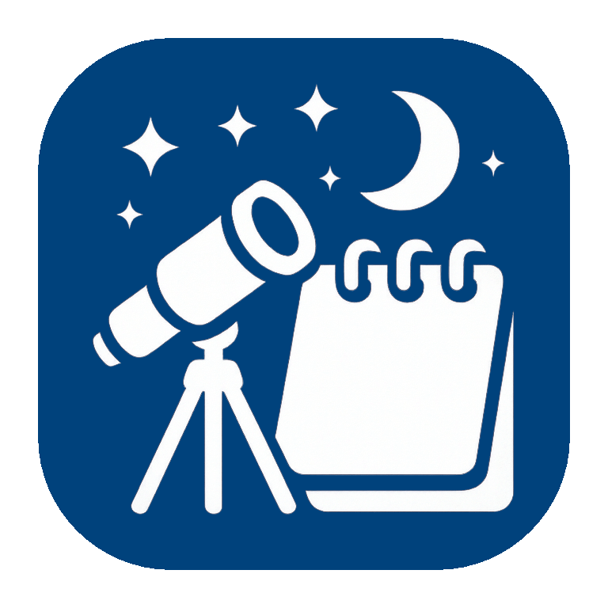
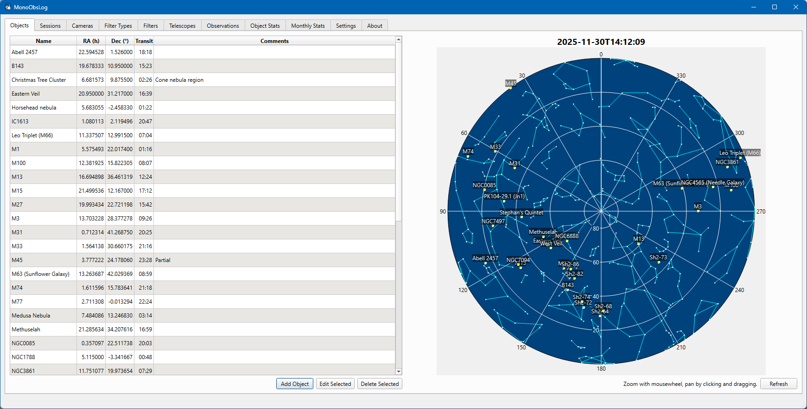
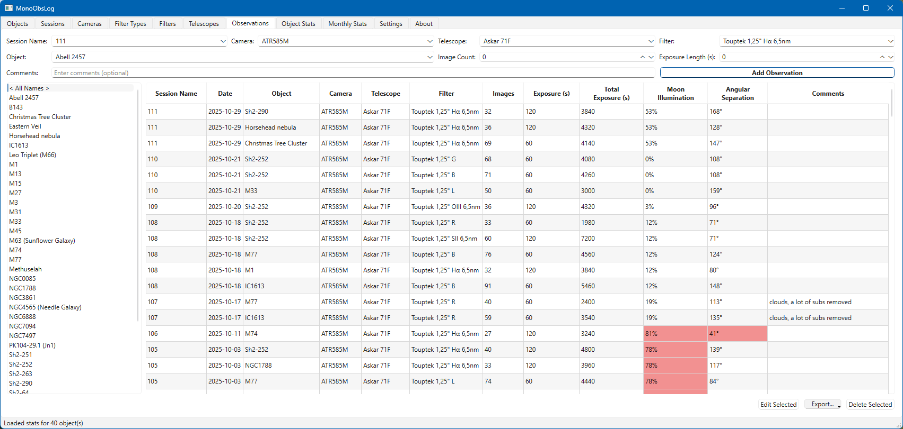
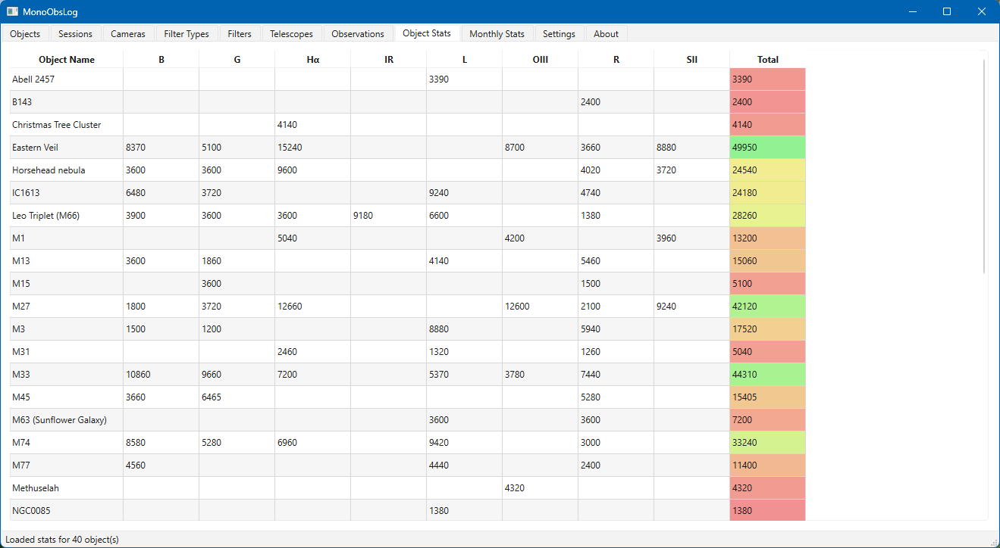

# MonoObsLog - astrophotography logging application

Application for managing astrophotography observations with SQLite database storage.

Special focus is on supporting mono workflows.

This was an Excel workbook, then a Python application and now in C++ Qt6.

## Features

- **Objects view with rudimentary sky view**
  

- **Observation Log View**

  - All objects listed on the left for quick filtering
  - If object coordinates have been entered then shows approximate distance from Moon and Moon illumination (with configurable warning threshold)
  - Export button exports observation list either in Excel or HTML file

- **Object statistics**: Per filter-type exposure totals for each object.

- **Monthly statistics**: Cumulative observation hours per month.
- **Moon data**: Illumination percentages and angular separation calculated for each observation (not intended to be super precise - just there to get a rough overview of potential data quality issues)
- **Export**: Observations can be exported as an Excel or HTML file.
- **SQLite Storage**: All data persisted in a local SQLite database.
- **Database backup**: Database is backed up weekly to a subfolder. The size is expected to be small so no automatic cleanup exists.

## Requirements for running

- Releases should only require installing Microsoft C Runtime:
  [Link to download](https://learn.microsoft.com/en-us/cpp/windows/latest-supported-vc-redist?view=msvc-170#latest-supported-redistributable-version)
- I have not tested on anything else than Windows 11

## Installation

1. Install the Microsoft C Runtime
2. Just unzip the release somewhere suitable
3. On first run it will ask for where to save the database. Database backups will be done to a subfolder in same location.

## How to Use

### Settings
Some functionality is useless unless proper location is set in Settings tab. Also, the application assumes that your observing location has the same timezone as your computer.

### Adding Data
1. Add Telescopes, Cameras, Filter Types, Filters, Objects and Sessions first
2. Now you can add Observations

### Working with Filters
**Important**: You must create Filter Types before you can add Filters, as each Filter requires a Filter Type.

1. Go to the "Filter Types" tab
2. Add filter types (e.g., "Luminance", "Red", "Ha")
3. Go to the "Filters" tab
4. Add filters (e.g. My Favorite Company 12nm Ha) and select their type from the dropdown

## Features by Tab

### Objects Tab
- Supports querying location data from Simbad server. Or you can add the coordinates yourself. This is not required but needed for Moon angular separation calculations and display on sky view.
- Shows current sky view with added objects marked. Very rudimentary, I don't plan to develop this to a full planetarium program.

### Sessions Tab
- Intended usage is to add sessions by the date of the evening before the session. (So if you started imaging after midnight enter the previous day) The logic for moon calculations is based on that. Why? Personal preference 🙂

### Observations Tab
- List on the left can be used to filter to one object
- Export button allows to export the whole list to either Excel or HTML file

### Cameras Tab and Telescopes tab
- The technical data is not used at the moment. Maybe in the future if I think of something.

### Filter Types Tab
- Meant to allow combining statistical data from different filters of the same type. If you don't want that then feel free to create a different filter type for each filter.

## Building
See [BUILD.md](BUILD.md)

## Misc
- **UI Framework**: Qt6
- **Database**: SQLite3
- **Coding**: Some of the code is written by using AI coding agents. I don't blindly trust what they spit out, but there certainly can be some weird choices in architecture and code logic. It's a hobby project, so I appreciate the time it saves me. No, I'm not a professional C++ developer so don't run this program on a space station life support system controller 🙂